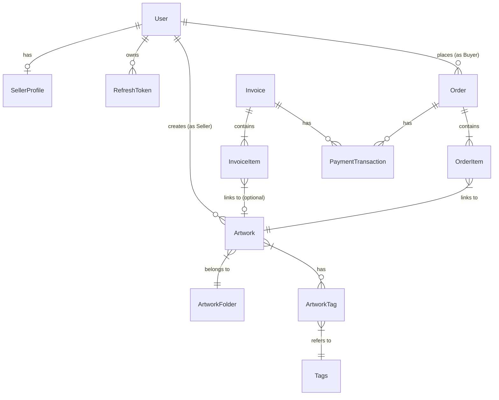

# 3.4. THIẾT KẾ DỮ LIỆU (DATA DESIGN)

Hệ thống sử dụng cơ sở dữ liệu quan hệ (PostgreSQL) với thiết kế lược đồ (Schema) phân tán theo từng Microservice. Tuy nhiên, về mặt logic, các thực thể liên kết chặt chẽ với nhau.

## 1. Mô hình Thực thể (Entities)

### A. Identity Module
*   **User**: `id`, `email`, `password_hash`, `full_name`, `avatar_url`, `is_verified`, `created_at`.
*   **SellerProfile**: `id`, `user_id`, `bio`, `website`, `social_links` (Thông tin mở rộng cho Nghệ sĩ).
*   **RefreshToken**: `id`, `user_id`, `token_hash`, `expires_at` (Quản lý phiên đăng nhập).

### B. Artwork & Inventory Module
*   **Artwork**: `id`, `seller_id`, `title`, `description`, `price`, `status` (ACTIVE, SOLD, HIDDEN), `images` (JSON), `medium`, `dimensions`.
*   **ArtworkFolder**: `id`, `seller_id`, `name` (Quản lý danh mục/bộ sưu tập cá nhân).
*   **Tags**: `id`, `name`.
*   **ArtworkTag**: Bảng trung gian (Many-to-Many) giữa Artwork và Tags.

### C. Sales & Payments Module (Quick Sell & E-commerce)
*   **Invoice (Quick Sell)**: `id`, `code` (mã hóa đơn), `seller_id`, `buyer_email`, `buyer_name`, `total_amount`, `status` (UNPAID, PAID), `tax_amount`, `shipping_fee`.
*   **InvoiceItem**: `id`, `invoice_id`, `artwork_id` (nullable - nếu là custom item), `item_name`, `price`, `quantity`.
*   **Order (E-commerce)**: `id`, `buyer_id`, `status`, `total`.
*   **PaymentTransaction**: `id`, `invoice_id`/`order_id`, `provider` (Stripe), `transaction_id`, `amount`, `status`.

## 2. Sơ đồ Quan hệ Thực thể (ERD) - Mức Logic

## 3. Ghi chú Triển khai
- Các bảng được lưu trữ tách biệt vật lý trong các Database/Schema khác nhau của từng Service (`identity_db`, `artwork_db`, `payment_db`).
- Việc tham chiếu giữa các Service (ví dụ: `Invoice` tham chiếu `seller_id`) chỉ lưu `ID` (UUID), không có khóa ngoại (Foreign Key) cứng ở cấp Database.
- Dữ liệu được đồng bộ hoặc truy vấn chéo thông qua API Gateway hoặc RPC khi cần thiết (Data Aggregation).
