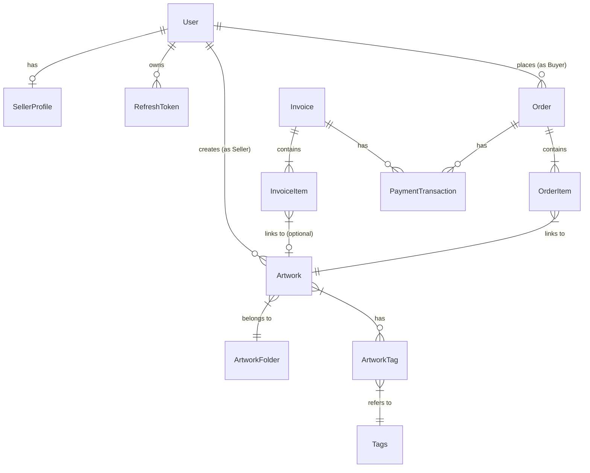
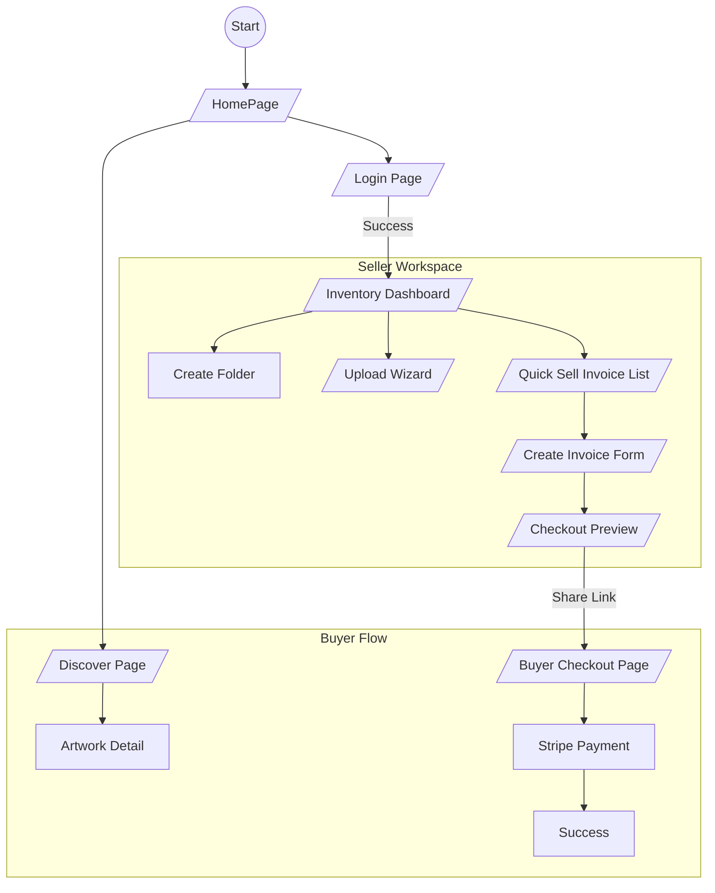

# BÁO CÁO ĐỒ ÁN MÔN HỌC: ARTIUM - NỀN TẢNG QUẢN LÝ VÀ KINH DOANH NGHỆ THUẬT

## CHƯƠNG 1: GIỚI THIỆU ĐỀ TÀI

### 1.1 Lý do chọn đề tài
Trong bối cảnh thị trường nghệ thuật ngày càng phát triển, nhu cầu số hóa quy trình quản lý và kinh doanh của các nghệ sĩ độc lập ngày càng cao. Tuy nhiên, các giải pháp hiện tại thường rời rạc hoặc quá phức tạp. **Artium** ra đời với sứ mệnh cung cấp một giải pháp "All-in-One", giúp nghệ sĩ dễ dàng quản lý kho tác phẩm (Inventory), tiếp cận khách hàng (Discover) và thực hiện giao dịch nhanh chóng (Quick Sell).

### 1.2 Mục tiêu
*   **Xây dựng hệ thống Microservices**: Đảm bảo khả năng mở rộng và bảo trì dễ dàng cho Backend.
*   **Phát triển Frontend hiện đại**: Tối ưu trải nghiệm người dùng (UX) với Single Page Application (SPA), sử dụng các công nghệ mới nhất như Next.js 16 và React 19.
*   **Tự động hóa quy trình kinh doanh**: Từ việc đăng tải tác phẩm, tạo hóa đơn bán hàng đến thanh toán trực tuyến.

### 1.3 Phạm vi thực hiện
Hệ thống tập trung vào các tính năng cốt lõi cho **Nghệ sĩ (Seller)** và **Người mua (Buyer)**:
*   **Authentication**: Đăng ký, Đăng nhập (Email/Google), Quản lý phiên làm việc.
*   **Inventory Management**: Quản lý kho tác phẩm, sắp xếp thư mục, tải lên nhiều ảnh.
*   **Discover**: Trang khám phá tác phẩm dành cho người mua.
*   **Quick Sell**: Công cụ tạo hóa đơn và thanh toán nhanh tại quầy hoặc qua link.
*   **Order & Payment**: Tích hợp cổng thanh toán Stripe.

### 1.4 Bố cục báo cáo
Báo cáo được chia làm 5 chương:
*   **Chương 1**: Giới thiệu tổng quan về đề tài.
*   **Chương 2**: Các công nghệ và kỹ thuật được sử dụng.
*   **Chương 3**: Phân tích kiến trúc hệ thống, thiết kế API và cơ sở dữ liệu.
*   **Chương 4**: Thiết kế chi tiết giao diện và trải nghiệm người dùng.
*   **Chương 5**: Tổng kết kết quả và hướng phát triển.

---

## CHƯƠNG 2: CÔNG NGHỆ SỬ DỤNG

### 2.1 Frontend (Web Application)
*   **Framework**: [Next.js 16.1.1](https://nextjs.org/) - Framework React mạnh mẽ hỗ trợ SSR và CSR.
*   **Library**: [React 19](https://react.dev/) - Thư viện xây dựng giao diện người dùng.
*   **Language**: [TypeScript](https://www.typescriptlang.org/) - Đảm bảo tính chặt chẽ của dữ liệu (Type-safety).
*   **Styling**:
    *   **Tailwind CSS v4**: Utility-first CSS framework giúp thiết kế nhanh chóng.
    *   **Radix UI**: Bộ thư viện Headless UI đảm bảo tính truy cập (Accessibility).
*   **State Management**:
    *   **Zustand**: Quản lý trạng thái toàn cục (Global State) nhẹ nhàng và hiệu quả.
    *   **React Query / SWR**: Quản lý trạng thái từ Server (Server State).
*   **Routing**: Next.js Pages Router.

### 2.2 Backend (Services)
*   **Framework**: [NestJS](https://nestjs.com/) - Framework Node.js kiến trúc module, hỗ trợ Microservices.
*   **Architecture**: Monorepo (Nx style) với Microservices.
*   **Communication**:
    *   **TCP (RPC)**: Giao tiếp đồng bộ giữa API Gateway và các Service.
    *   **RabbitMQ**: Message Broker cho xử lý bất đồng bộ (Background Jobs).
*   **API Style**: RESTful API & GraphQL (Apollo Federation).

### 2.3 Cơ sở dữ liệu & Hạ tầng
*   **Database**: PostgreSQL - Hệ quản trị cơ sở dữ liệu quan hệ mạnh mẽ.
*   **ORM**: TypeORM - Ánh xạ đối tượng vào cơ sở dữ liệu.
*   **Containerization**: Docker & Docker Compose - Đóng gói ứng dụng để triển khai nhất quán.
*   **Orchestration**: Kubernetes (K8s) - Quản lý vận hành các container.

---

## CHƯƠNG 3: PHÂN TÍCH VÀ THIẾT KẾ HỆ THỐNG

### 3.1 Kiến trúc hệ thống

#### 3.1.1 Mô hình Microservices
Hệ thống Artium được chia thành các dịch vụ độc lập, giao tiếp thông qua API Gateway:

*   **API Gateway**: Cổng vào duy nhất, xử lý Routing, Auth Guard và Rate Limiting.
*   **Identity Service**: Quản lý User, Auth, Profile.
*   **Artwork Service**: Quản lý tác phẩm (Artwork), Kho (Inventory), Tags.
*   **Orders Service**: Quản lý đơn hàng, giỏ hàng.
*   **Payments Service**: Xử lý thanh toán, hóa đơn (Invoices).
*   **Messaging Service**: Chat realtime.
*   **Notifications Service**: Thông báo hệ thống.

#### 3.1.2 Luồng dữ liệu (Data Flow)
1.  **Client** gửi request HTTP đến **API Gateway**.
2.  **API Gateway** xác thực Token (nếu cần) thông qua **Identity Service**.
3.  Request được chuyển tiếp (qua TCP/RPC) đến Service đích (ví dụ: Inventory Service).
4.  Service xử lý nghiệp vụ, truy xuất **PostgreSQL**, trả kết quả về Gateway.
5.  Gateway phản hồi cho Client.

### 3.2 Mô tả các thành phần trong hệ thống

#### 3.2.1 Frontend Architecture (Domain-Driven Design)
Frontend áp dụng cấu trúc thư mục dựa trên Domain để dễ bảo trì:
*   `src/@domains/inventory`: Logic quản lý kho.
*   `src/@domains/auth`: Logic xác thực.
*   `src/@domains/discover`: Logic trang khám phá.
*   `src/@shared`: Các component dùng chung (Button, Input).

#### 3.2.2 Backend API Endpoints (Chính)
*   **Identity**: `/auth/login`, `/auth/register`, `/users/me`
*   **Inventory**: `/artwork` (CRUD), `/artwork/folders`
*   **Quick Sell**: `/payment/invoices` (Create Invoice), `/payment/create-intent`

### 3.3 Thiết kế dữ liệu

#### 3.3.1 Mô hình Thực thể (Entities) - Logic
Hệ thống sử dụng các thực thể chính sau:

*   **User**: Người dùng hệ thống (Seller/Buyer).
*   **Artwork**: Tác phẩm nghệ thuật (Title, Price, Image, Status).
*   **Folder**: Thư mục chứa tác phẩm (trong Inventory).
*   **Invoice**: Hóa đơn bán hàng nhanh (Quick Sell).
*   **Order**: Đơn hàng thương mại điện tử.

#### 3.3.2 Sơ đồ ERD (Entity Relationship Diagram)

---

## CHƯƠNG 4: THIẾT KẾ MÀN HÌNH

### 4.1 Sơ đồ liên kết màn hình (Screen Flow)

### 4.2 Danh sách các màn hình
1.  **Dashboard Kho (`/inventory`)**: Quản lý tài sản.
2.  **Khám phá (`/discover`)**: Tìm kiếm tác phẩm.
3.  **Tải lên (`/artworks/upload`)**: Quy trình đăng tác phẩm 2 bước.
4.  **Tạo Hóa đơn (`/artist/invoices/create`)**: Bán hàng nhanh.
5.  **Thanh toán (`/artist/invoices/checkout`)**: Trang thanh toán cho khách.
6.  **Đăng nhập/Đăng ký**: Xác thực người dùng.

### 4.3 Mô tả các màn hình
*   **Inventory Page**: Sử dụng Grid Layout, cho phép lọc theo trạng thái, tìm kiếm (Debounce), chọn nhiều (Multi-select) để xóa/di chuyển. Dữ liệu được tải phân trang để tối ưu hiệu năng.
*   **Upload Wizard**: Form nhập liệu chia làm 2 bước (Essentials & Storytelling) giúp giảm tải nhận thức cho người dùng. Có tính năng lưu nháp (Auto-save).
*   **Quick Sell Checkout**: Trang thanh toán tối giản, hỗ trợ hiển thị 2 chế độ (Người bán xem trước & Người mua thanh toán). Tự động cập nhật trạng thái "Đã thanh toán" qua polling.

---

## CHƯƠNG 5: KẾT LUẬN

### 5.1 Kết luận
Đồ án đã xây dựng thành công nền tảng Artium với các tính năng cốt lõi:
*   Hệ thống Backend Microservices hoạt động ổn định, phân tách rõ ràng nhiệm vụ.
*   Frontend đạt chuẩn UX cao, giao diện hiện đại, tốc độ phản hồi nhanh.
*   Quy trình nghiệp vụ từ Upload -> Quản lý -> Bán hàng (Quick Sell) -> Thanh toán diễn ra trôi chảy.

### 5.2 Hướng phát triển
Một số tính năng đã được thiết kế kiến trúc nhưng chưa triển khai hoàn thiện (Future Work):
*   **Community Service**: Tính năng mạng xã hội, bình luận, tương tác giữa các nghệ sĩ.
*   **AI Recommendation**: Gợi ý tác phẩm dựa trên hành vi người dùng (đã có service `search-recommendation` chờ tích hợp).
*   **Mobile App**: Phát triển phiên bản ứng dụng di động sử dụng React Native (tận dụng lại API Gateway).

### 5.3 Lời kết
Artium không chỉ là một đồ án môn học mà là một nỗ lực nghiêm túc trong việc áp dụng các công nghệ tiên tiến nhất để giải quyết bài toán thực tế của giới nghệ sĩ. Nhóm thực hiện hy vọng sản phẩm sẽ là tiền đề tốt cho các phát triển xa hơn trong tương lai.
