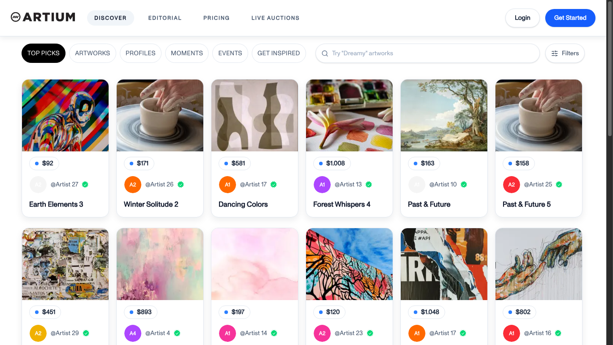
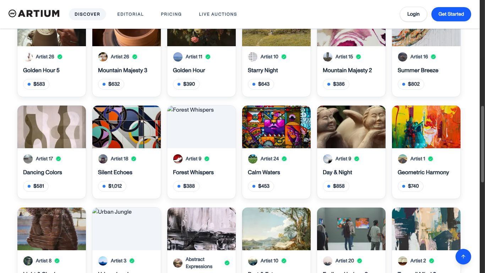
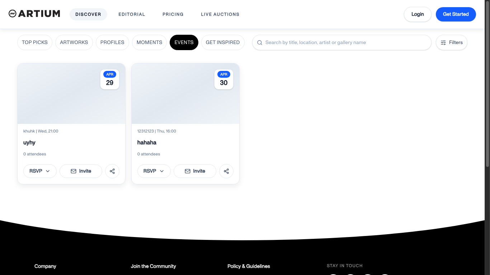
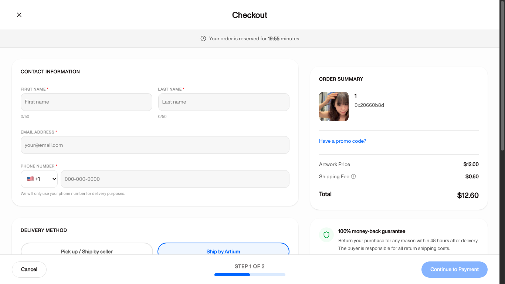
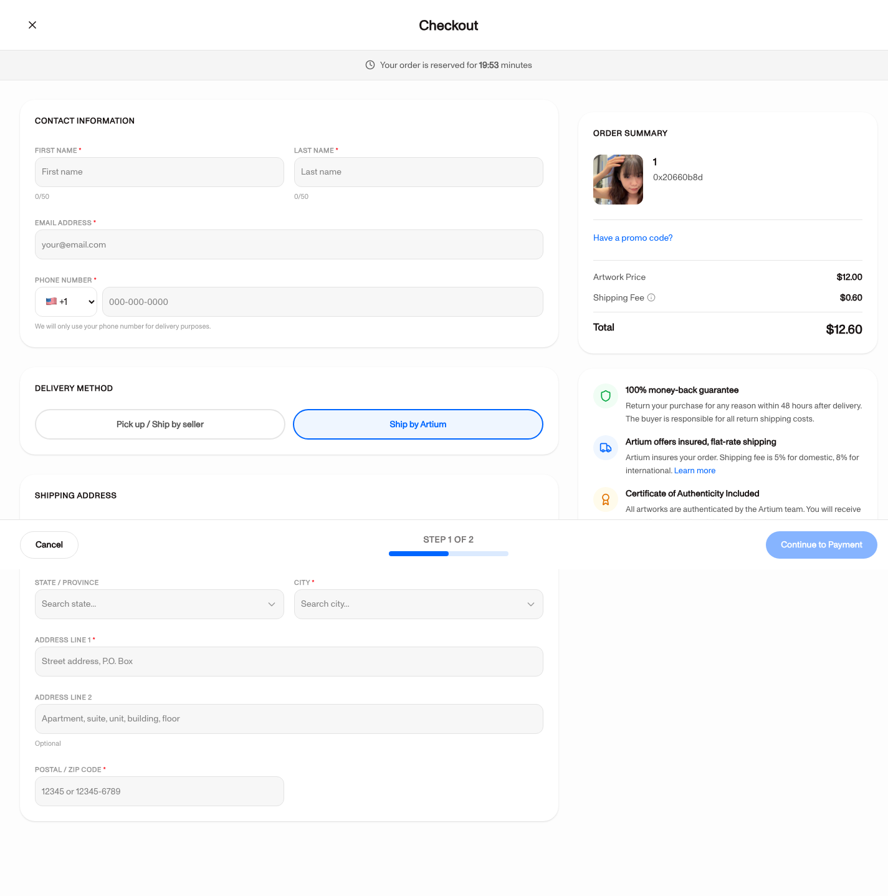

# Báo Cáo Tối Ưu Kỹ Thuật Web Frontend

## 1. Mục Tiêu

Mục tiêu của phần tối ưu là cải thiện hiệu năng frontend cho hai luồng chính của hệ thống:

- **Discover**: trang khám phá artwork, profile, event, moment.
- **Checkout**: luồng thanh toán artwork bằng card hoặc ví MetaMask.

Phạm vi tối ưu chỉ thực hiện ở **frontend**. Backend production không thay đổi, hệ thống vẫn gọi API production tại:

```text
https://api.dgpthinh.io.vn
```

Frontend được chạy ở production mode local:

```text
http://localhost:3000
```

Artwork dùng để đo checkout:

```text
477a93ea-b6b0-4e32-8122-2bfca3666c50
```

## 2. Điều Kiện Đo

| Nội dung | Giá trị |
|---|---|
| Frontend | Local production build |
| Backend | Production API |
| FE URL | `http://localhost:3000` |
| BE URL | `https://api.dgpthinh.io.vn` |
| Công cụ đo | Lighthouse, Chrome/CDP network capture, build manifest |
| Luồng đo chính | `/discover`, `/checkout/[artworkId]` |
| Thư mục minh chứng before | `docs/web-optimization/before/` |
| Thư mục minh chứng after | `docs/web-optimization/after/` |

API production đã được kiểm tra CORS và trả về `HTTP/2 200` cho frontend local. Minh chứng lưu tại:

```text
docs/web-optimization/after/network/api-cors-check-after.txt
```

## 3. Các Tối Ưu Đã Thực Hiện

### 3.1. Giảm Bundle Tải Ban Đầu Cho Discover

Trước tối ưu, trang Discover import trực tiếp toàn bộ grid/tab content như Artworks, Profiles, Moments, Events và Inspire. Điều này làm bundle ban đầu của `/discover` lớn.

Sau tối ưu:

- Chuyển các tab content trong Discover sang `next/dynamic`.
- Chỉ mount tab đang active.
- Thêm skeleton loading có chiều cao ổn định để tránh layout shift.
- Giữ nguyên behavior URL như `/discover?tab=...`.

### 3.2. Giảm Request Lặp Và Request Stale

Sau tối ưu:

- `apiFetch` hỗ trợ opt-in GET dedupe/cache ở client.
- Cache chỉ bật cho các API đọc dữ liệu Discover, TTL ngắn khoảng 30 giây.
- Không cache mutation, upload, checkout, payment.
- Infinite scroll hỗ trợ `AbortSignal` để hủy request cũ khi search/reset/unmount.
- Dùng request sequence để bỏ response cũ nếu request mới đã chạy.
- Search ở Discover dùng debounce để tránh gọi API liên tục theo từng ký tự.

### 3.3. Giảm CLS Cho Discover

Sau tối ưu:

- Artwork/Event card chính dùng `next/image`.
- Card ảnh có kích thước ổn định.
- Bỏ logic random height ở Top Picks.
- Ưu tiên metadata ảnh từ API nếu có, fallback về kích thước cố định.

### 3.4. Tối Ưu Checkout Wallet UX/RPC

Trước tối ưu, wallet state dễ bị sync sớm khi vào checkout, dù người dùng chưa chọn phương thức wallet.

Sau tối ưu:

- `useWalletCheckout` nhận thêm `enabled`.
- Chỉ bật wallet sync khi người dùng ở step payment và chọn wallet.
- Không gọi `eth_accounts` hoặc `eth_chainId` khi checkout vừa mount hoặc khi chọn card.
- Khi user reject/cancel MetaMask transaction, UI hiển thị lỗi retry rõ hơn.
- Disable Pay Now trong lúc tạo order/chờ MetaMask để tránh double submit.

## 4. Kết Quả Lighthouse Before/After

| Page | Performance Before | Performance After | Delta | LCP Before | LCP After | CLS Before | CLS After | TBT Before | TBT After |
|---|---:|---:|---:|---:|---:|---:|---:|---:|---:|
| Discover desktop | 71 | 81 | +10 | 2.3s | 1.7s | 0.320 | 0.230 | 0ms | 0ms |
| Discover mobile | 57 | 79 | +22 | 5.1s | 5.5s | 1.077 | 0.000 | 63ms | 47ms |
| Checkout desktop | 66 | 74 | +8 | 6.3s | 4.7s | 0.000 | 0.000 | 140ms | 143ms |
| Checkout mobile | 50 | 53 | +3 | 23.2s | 20.9s | 0.000 | 0.002 | 794ms | 985ms |

Nhận xét:

- Discover desktop tăng từ **71 lên 81**.
- Discover mobile tăng từ **57 lên 79**.
- CLS của Discover mobile giảm mạnh từ **1.077 xuống 0.000**.
- Checkout mobile LCP giảm từ **23.2s xuống 20.9s**.
- Checkout cải thiện ít hơn Discover vì bundle checkout gần như không thay đổi nhiều.

Minh chứng Lighthouse:

```text
docs/web-optimization/before/lighthouse/
docs/web-optimization/after/lighthouse/
```

## 5. Kết Quả Bundle Before/After

| Route | Before | After | Delta | Mức thay đổi |
|---|---:|---:|---:|---:|
| `/_app` | 810.5 KiB | 811.5 KiB | +1.0 KiB | +0.1% |
| `/discover` | 1039.0 KiB | 608.0 KiB | -431.0 KiB | -41.5% |
| `/checkout/[artworkId]` | 344.4 KiB | 344.6 KiB | +0.2 KiB | +0.1% |

Nhận xét:

- Route `/discover` giảm từ **1039.0 KiB xuống 608.0 KiB**.
- Tổng dung lượng route Discover giảm **431.0 KiB**, tương đương khoảng **41.5%**.
- Nguyên nhân chính là tách bundle theo tab bằng dynamic import, chỉ tải phần cần thiết trước.

Minh chứng bundle:

```text
docs/web-optimization/before/bundle/route-size-before.txt
docs/web-optimization/after/bundle/route-size-after.txt
docs/web-optimization/after/bundle/top-chunks-after.txt
```

## 6. Kết Quả Network/API Before/After

| Scenario | Requests Before | Requests After | Delta | Transfer Before | Transfer After | API Before | API After | API lỗi sau tối ưu |
|---|---:|---:|---:|---:|---:|---:|---:|---:|
| Discover first load | 84 | 77 | -7 | 2338.8 KiB | 660.1 KiB | 2 | 2 | 0 |
| Discover artworks scroll | 139 | 132 | -7 | 3446.4 KiB | 303.4 KiB | 3 | 3 | 0 |
| Discover events tab | 65 | 59 | -6 | 18.2 KiB | 43.7 KiB | 2 | 2 | 0 |
| Checkout first load | 60 | 54 | -6 | 2787.6 KiB | 3202.8 KiB | 2 | 2 | 0 |

Nhận xét:

- Số lượng request giảm ở cả 4 scenario đo tự động.
- Discover first load giảm từ **84 request xuống 77 request**.
- Discover artworks scroll giảm từ **139 request xuống 132 request**.
- Checkout first load giảm từ **60 request xuống 54 request**.
- Các API production trong lần đo after đều trả `200`, không có API `>=400`.
- Một số lỗi 404 còn thấy trong Chrome log là do URL ảnh Unsplash trong dữ liệu backend bị chết, không phải lỗi API backend.

Minh chứng network sau tối ưu:

```text
docs/web-optimization/after/network/network-summary-after.md
docs/web-optimization/after/network/*.network.json
docs/web-optimization/after/network/*.png
```

## 7. Ảnh Minh Họa Network/API

### Hình 1. Discover first load sau tối ưu

Ảnh này chứng minh trang Discover sau tối ưu đã render được dữ liệu từ production API, không còn trạng thái lỗi load data.



### Hình 2. Discover artworks scroll sau tối ưu

Ảnh này dùng để minh họa luồng infinite scroll sau tối ưu. API page 1 và page 2 đều trả `200`, không có API lỗi.



### Hình 3. Discover events tab sau tối ưu

Ảnh này minh họa việc chuyển tab Events sau tối ưu. API `/events/discover` trả `200`.



### Hình 4. Checkout first load sau tối ưu

Ảnh này minh họa checkout load artwork từ production API thành công. API artwork detail trả `200`.



## 8. Kết Quả RPC/MetaMask

### 8.1. Kết quả đo tự động

Đã chạy kiểm tra bằng Chrome/CDP với mock `window.ethereum` provider để xác nhận checkout first load không gọi RPC trước khi người dùng chọn wallet.

Kết quả:

| Check | Before | After |
|---|---|---|
| RPC trước khi chọn wallet | Chưa tách riêng được trong baseline thủ công | `0` call `window.ethereum.request` |
| Khi người dùng chưa chọn wallet | Có nguy cơ sync ví sớm | Không gọi `eth_accounts`, không gọi `eth_chainId` |

Minh chứng:

```text
docs/web-optimization/after/rpc/rpc-count-after.txt
```

Ảnh minh họa checkout first load với mock provider:



## 9. Tổng Hợp Cải Thiện Chính

| Nhóm yêu cầu | Before | After | Kết quả |
|---|---|---|---|
| Lighthouse Discover mobile | 57 | 79 | Tăng 22 điểm |
| Lighthouse Discover desktop | 71 | 81 | Tăng 10 điểm |
| Discover mobile CLS | 1.077 | 0.000 | Cải thiện mạnh |
| Bundle `/discover` | 1039.0 KiB | 608.0 KiB | Giảm 431.0 KiB |
| Discover first load requests | 84 | 77 | Giảm 7 request |
| Discover scroll requests | 139 | 132 | Giảm 7 request |
| Checkout first load requests | 60 | 54 | Giảm 6 request |
| RPC trước khi chọn wallet | Chưa tách riêng | 0 call | Không gọi ví sớm |

## 10. Kết Luận

Sau khi tối ưu frontend, hệ thống đạt được các cải thiện rõ ràng ở luồng Discover:

- Giảm đáng kể bundle tải ban đầu.
- Giảm số lượng request.
- Giảm layout shift.
- Lighthouse mobile và desktop tăng điểm.
- Network after chứng minh API production trả `200` và trang render được dữ liệu.

Đối với Checkout, mức cải thiện nhỏ hơn nhưng vẫn có kết quả:

- Checkout mobile LCP giảm.
- Request count giảm.
- Wallet RPC không còn bị gọi sớm trước khi người dùng chọn phương thức wallet.
- UX khi user cancel/reject MetaMask transaction được xử lý rõ hơn.

Các minh chứng before/after đã được lưu đầy đủ trong:

```text
docs/web-optimization/before/
docs/web-optimization/after/
docs/web-optimization/report.md
```

## 11. Danh Sách File Minh Chứng

| Nhóm minh chứng | File/thư mục |
|---|---|
| Summary before | `docs/web-optimization/before/summary.md` |
| Summary after | `docs/web-optimization/after/summary.md` |
| Report before/after | `docs/web-optimization/report.md` |
| Báo cáo có ảnh minh họa | `docs/web-optimization/report-for-docs.md` |
| Lighthouse before | `docs/web-optimization/before/lighthouse/` |
| Lighthouse after | `docs/web-optimization/after/lighthouse/` |
| Network before | `docs/web-optimization/before/network/` |
| Network after | `docs/web-optimization/after/network/` |
| Bundle before | `docs/web-optimization/before/bundle/` |
| Bundle after | `docs/web-optimization/after/bundle/` |
| RPC after | `docs/web-optimization/after/rpc/` |

